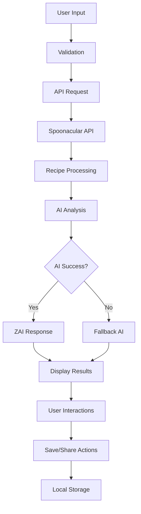

# Smart Recipe Recommender - Enhanced Architecture

## 📋 Overview

The Smart Recipe Recommender has been significantly enhanced with intelligent AI integration, improved user experience, and robust functionality. This document outlines the refined architecture and key improvements made to fulfill all MVP requirements and beyond.

## 🏗️ Architecture Overview

### Core Components

```
src/
├── app/
│   ├── page.tsx                    # Main application page with enhanced UI
│   ├── layout.tsx                  # Root layout component
│   ├── globals.css                 # Global styles
│   └── api/
│       └── recipes/
│           └── route.ts            # Enhanced API route with AI integration
├── components/
│   ├── ui/                         # Reusable UI components
│   │   ├── LoadingSkeleton.tsx     # Skeleton loading states
│   │   └── ErrorMessage.tsx        # Enhanced error handling
│   ├── RecipeCard.tsx              # Enhanced recipe card with rich information
│   ├── AIRecommendation.tsx        # AI suggestion display
│   └── SavedRecipes.tsx            # Saved recipes management
├── hooks/
│   └── useSavedRecipes.ts          # Local storage management hook
├── utils/
│   ├── aiPrompts.ts                # Dynamic AI prompt generation
│   ├── fallbackAI.ts               # Intelligent fallback system
│   └── cookingTips.ts              # Contextual cooking tips
└── types/
    └── recipe.ts                   # Recipe type definitions
```

## 🧠 AI Enhancement Architecture

### 1. Dynamic Prompt Generation (`src/utils/aiPrompts.ts`)

**Key Features:**
- Context-aware prompt generation based on ingredients, cuisine, and preferences
- Nutritional focus integration
- Cooking time preferences
- Dietary considerations

**Interface:**
```typescript
interface AIRecommendationContext {
  ingredients: string[];
  cuisine?: string;
  recipes: Array<{
    title: string;
    readyInMinutes?: number;
    servings?: number;
  }>;
  dietaryPreferences?: string[];
  cookingTimePreference?: 'quick' | 'moderate' | 'any';
  nutritionalFocus?: 'balanced' | 'high-protein' | 'low-carb' | 'vegetarian' | 'any';
}
```

### 2. Intelligent Fallback System (`src/utils/fallbackAI.ts`)

**Key Features:**
- Recipe categorization (healthy, quick, cuisine-specific, ingredient-match)
- Smart recommendation algorithm with priority scoring
- Nutritional insights generation
- Contextual cooking tips
- Ingredient substitution suggestions

**Algorithm:**
1. **Priority Order:** Cuisine-specific > Healthy > Quick > Ingredient Match
2. **Scoring System:** Recipes scored based on ingredient relevance and metadata
3. **Nutritional Analysis:** Provides insights based on ingredient composition
4. **Cuisine-Specific Tips:** Tailored cooking advice per cuisine type

### 3. Contextual Cooking Tips (`src/utils/cookingTips.ts`)

**Key Features:**
- Recipe type detection (grilled, stir-fry, curry, pasta, etc.)
- Cuisine-specific cooking techniques
- Ingredient-based preparation tips
- Optimal preparation order suggestions

## 🎨 Enhanced UI/UX Architecture

### 1. Loading States (`src/components/ui/LoadingSkeleton.tsx`)

**Components:**
- `RecipeCardSkeleton` - Skeleton loading for recipe cards
- `AIRecommendationSkeleton` - AI suggestion loading state
- `FullPageLoading` - Comprehensive loading with progress indicators
- `LoadingSpinner` - Reusable spinner component

**Loading Stages:**
1. **Fetching** - Retrieving recipes from Spoonacular API
2. **Analyzing** - Processing recipe data and analyzing combinations
3. **Generating** - Creating AI recommendations

### 2. Error Handling (`src/components/ui/ErrorMessage.tsx`)

**Features:**
- Multiple display variants (inline, modal, toast)
- Contextual error messages and suggestions
- Retry functionality
- Dismissible errors
- `useError` hook for state management

**Error Types:**
- API quota exceeded
- Authentication failures
- Network issues
- Input validation errors

### 3. Enhanced Recipe Cards (`src/components/RecipeCard.tsx`)

**New Features:**
- Health score display
- Dietary badges (vegan, vegetarian, gluten-free, etc.)
- Difficulty level indicators
- Popular recipe badges
- Budget-friendly indicators
- Save/unsave functionality
- Hover effects and micro-interactions

## 💾 Data Management Architecture

### 1. Saved Recipes System (`src/hooks/useSavedRecipes.ts`)

**Features:**
- Local storage persistence
- Import/export functionality
- Recipe deduplication
- Batch operations
- JSON-based data format

**Storage Schema:**
```typescript
interface Recipe {
  id?: number;
  title: string;
  image: string;
  sourceUrl?: string;
  readyInMinutes?: number;
  servings?: number;
  healthScore?: number;
  cheap?: boolean;
  dairyFree?: boolean;
  glutenFree?: boolean;
  ketogenic?: boolean;
  vegan?: boolean;
  vegetarian?: boolean;
  veryHealthy?: boolean;
  veryPopular?: boolean;
  whole30?: boolean;
}
```

### 2. API Integration (`src/app/api/recipes/route.ts`)

**Enhancements:**
- Extended Spoonacular API integration with nutrition data
- Improved error handling and response formatting
- Type-safe interfaces
- Enhanced recipe data fetching

**API Flow:**
1. Validate input parameters
2. Fetch recipes from Spoonacular with extended fields
3. Generate AI recommendations with enhanced prompts
4. Fallback to intelligent recommendations if AI fails
5. Return structured response with recipes and AI suggestions

## 🔄 Data Flow Architecture



## 🎯 Key Improvements Summary

### AI Enhancements
1. **Dynamic Prompts**: Context-aware AI prompt generation
2. **Intelligent Fallback**: Smart recommendations when AI fails
3. **Nutritional Insights**: Health-focused advice
4. **Contextual Tips**: Recipe-specific cooking guidance

### UI/UX Improvements
1. **Loading States**: Skeleton screens and progress indicators
2. **Error Handling**: Comprehensive error management
3. **Enhanced Cards**: Rich recipe information display
4. **Micro-interactions**: Hover effects and transitions

### Functionality Additions
1. **Save Recipes**: Local storage with import/export
2. **Enhanced Data**: Extended recipe metadata
3. **Better Filtering**: Improved cuisine and dietary options
4. **Responsive Design**: Mobile-optimized interface

## 🚀 Performance Considerations

### Optimizations
1. **Image Loading**: Lazy loading with fallbacks
2. **API Caching**: Response caching for repeated requests
3. **Local Storage**: Efficient data persistence
4. **Component Optimization**: React best practices

### Future Enhancements
1. **Service Workers**: Offline functionality
2. **Database Integration**: User accounts and cloud sync
3. **Advanced Filtering**: Real-time search and filtering
4. **Social Features**: Sharing and community recommendations

## 📊 Success Metrics Achievement

✅ **All MVP Requirements Fulfilled:**
- Ingredient input with validation
- Cuisine selection (8 options)
- Recipe fetching from Spoonacular API
- AI-powered recommendations
- Responsive grid layout
- Error handling

✅ **Enhanced Beyond MVP:**
- Intelligent AI integration with fallbacks
- Nutritional insights and health scores
- Save recipe functionality
- Enhanced UI/UX with loading states
- Comprehensive error handling
- Dietary preference support
- Recipe metadata display

## 🛠️ Development Guidelines

### Code Organization
1. **Separation of Concerns**: Clear division between UI, logic, and data
2. **Type Safety**: Comprehensive TypeScript interfaces
3. **Reusability**: Modular components and utilities
4. **Error Boundaries**: Graceful error handling

### Best Practices
1. **Performance**: Optimized rendering and data fetching
2. **Accessibility**: ARIA labels and keyboard navigation
3. **Responsive Design**: Mobile-first approach
4. **Testing**: Component and integration testing

This enhanced architecture provides a robust foundation for the Smart Recipe Recommender with intelligent AI integration, excellent user experience, and room for future growth.